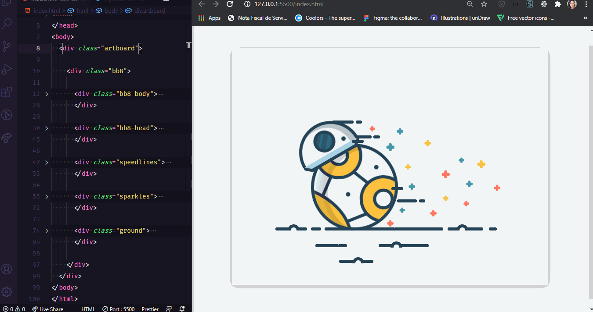

<h1 align="center">Desenho BB8 em HTML e CSS</h1>

  
  

<blockquote align="center">“A chave para transformação é a continuidade. Continue a codar!”</blockquote>

 

 
 

## Apresentação 
 

  

 

## Sobre o desenho do BB-8 em HTML e CSS
 

    Eu gosto muito de desenhar também gosto muito de frontend. 
    Esses dias passeando pelo o youtube vi um vídeo da DevTips que mostrava o processo de desenho e animação do BB-8 em HTML e CSS. Fiquei vidrada no vídeo.
    E não deu outra, tive que fazer meu próprio BB-8 seguindo o processo do vídeo.
    Abaixo está o link do vídeo para quem quiser brincar também.
    Divirtam-se!

https://www.youtube.com/watch?v=QZdj42liTtU&t=1s

 

## Tecnologias Utilizadas
 

- [x] HTML
- [x] CSS

 
 

 
 

<h3 align="center">
    
</h3>